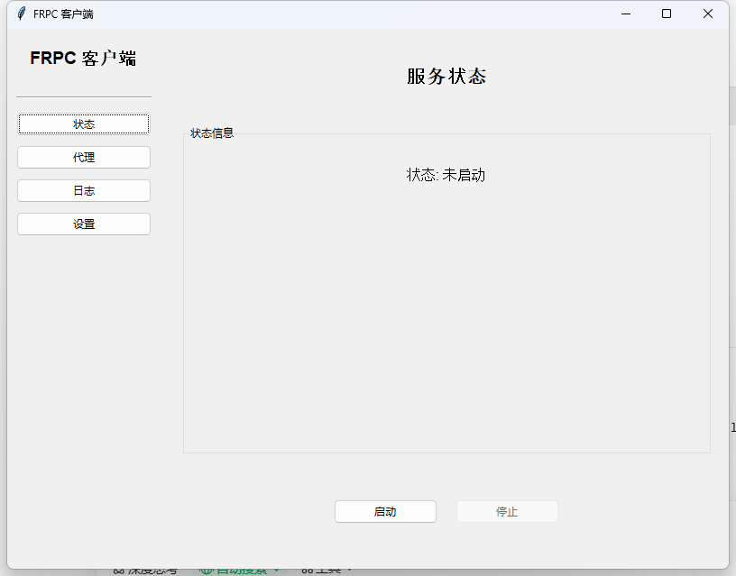
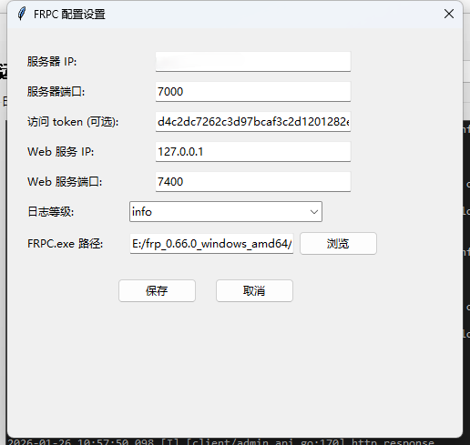
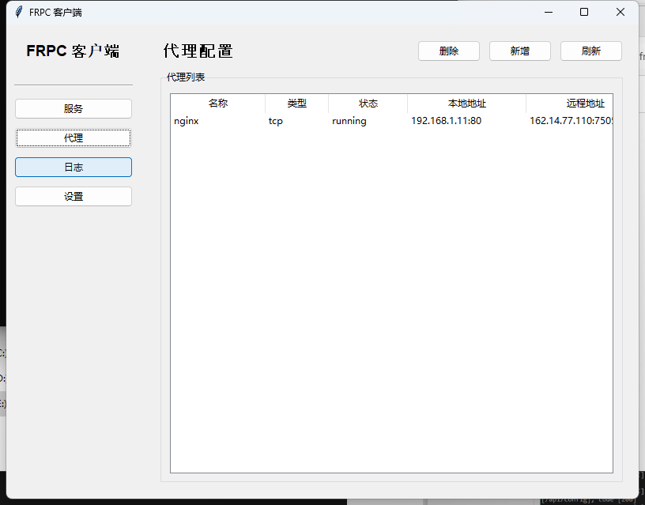
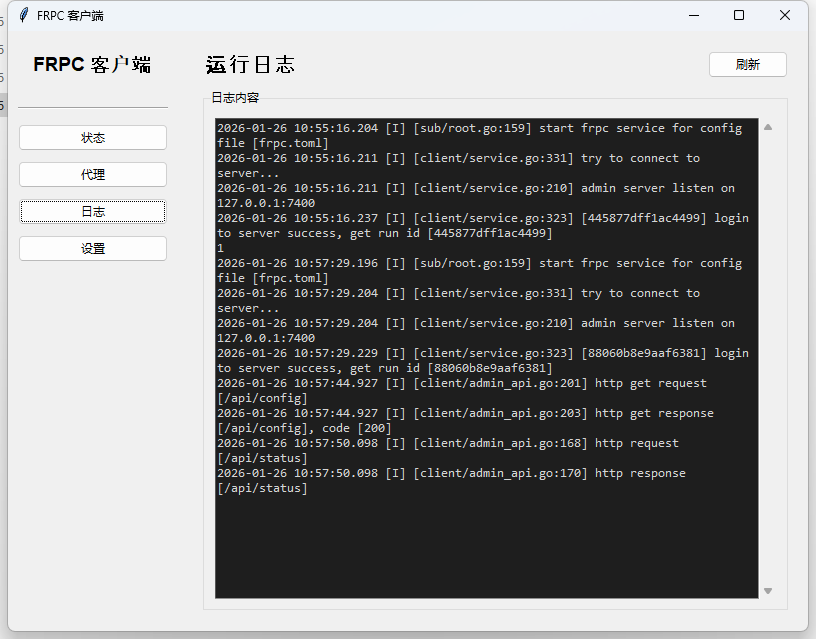

# FRPC 桌面客户端

一个基于 Python 和 Tkinter 开发的 FRPC 图形化桌面客户端，提供友好的用户界面来管理和配置 FRPC 服务。

## 功能特性

### 🎯 核心功能

- **服务管理**
  - 一键启动/停止 FRPC 服务
  - 实时显示服务运行状态
  - 自动检测服务状态
  

- **配置管理**
  - 图形化配置界面
  - 支持服务器地址、端口、Token 等基础配置
  - 支持 Web 服务地址和端口配置
  - 支持日志级别配置
  - 自动保存配置到 `frpc.toml`
  

- **代理管理**
  - 可视化代理列表
  - 支持新增、编辑代理配置
  - 支持多种代理类型：TCP、UDP、HTTP、HTTPS、TCPMux、STCP、SUDP、XTCP
  - 根据代理类型动态显示配置字段
  - 实时同步代理状态
  

- **日志查看**
  - 实时日志显示
  - 自动刷新（每2秒）
  - 自动滚动到底部
  - 支持手动刷新和清空日志
  

- **数据验证**
  - IP 地址格式验证
  - 端口范围验证（1-65535）
  - 服务器端口范围限制
  - 防止非法输入

## 系统要求

- Python 3.7 或更高版本
- Windows 操作系统（推荐）
- FRPC 可执行文件（`frpc.exe`）

## 安装说明

### 1. 克隆或下载项目

```bash
git clone <repository-url>
cd frpc-gui
```

### 2. 安装依赖

```bash
pip install -r requirements.txt
```

如果没有 `requirements.txt`，需要安装以下依赖：

```bash
pip install requests
```

### 3. 准备 FRPC 可执行文件

确保您有 FRPC 的可执行文件（`frpc.exe`），可以从 [FRP 官方仓库](https://github.com/fatedier/frp) 下载。

## 使用方法

### 启动应用

```bash
python main.py
```

### 首次使用

1. **初始化配置**
   - 首次启动时，如果检测到 `frpc.toml` 不存在，会自动弹出配置窗口
   - 填写服务器 IP、端口、Token（可选）等信息
   - 配置 FRPC.exe 路径
   - 设置服务器端口范围（用于限制代理的远程端口）
   - 点击"保存"完成配置

2. **启动服务**
   - 在"服务"页面点击"启动"按钮
   - 服务启动后，状态会显示为"运行中"
   - 此时"代理"菜单会变为可用状态

3. **管理代理**
   - 点击"代理"菜单进入代理管理页面
   - 点击"新增"按钮添加新代理
   - 双击列表中的代理可以编辑
   - 支持多种代理类型，根据类型自动显示相应配置字段

4. **查看日志**
   - 点击"日志"菜单查看运行日志
   - 日志会自动刷新
   - 可以手动点击"刷新"或"清空"按钮

5. **修改设置**
   - 点击"设置"菜单可以重新配置基础设置
   - 修改设置不会影响已有的代理配置

## 配置说明

### 基础配置

配置文件：`frpc.toml`

```toml
serverAddr = "服务器地址"
serverPort = 7000

# 认证配置
auth.method = "token"
auth.token = "访问令牌（可选）"

# 监控
webServer.addr = "127.0.0.1"
webServer.port = 7400

# 日志配置
log.to = "frpc.log"
log.level = "info"  # trace, debug, info, warn, error
```

### 代理配置示例

```toml
[[proxies]]
name = "代理名称"
type = "tcp"  # tcp, udp, http, https, tcpmux, stcp, sudp, xtcp
enabled = true
localIP = "127.0.0.1"
localPort = 8080
remotePort = 6000  # TCP/UDP 类型需要
# subdomain = "子域名"  # HTTP/HTTPS/TCPMux 类型需要
# customDomains = ["域名1", "域名2"]  # HTTP/HTTPS/TCPMux 类型需要
```

### 应用配置

配置文件：`frpc_config.json`

```json
{
  "frpc_exe_path": "E:/frp_0.66.0_windows_amd64/frpc.exe",
  "port_range_min": 1,
  "port_range_max": 65535
}
```

## 项目结构

```
frpc-gui/
├── main.py              # 程序入口
├── service.py            # 主窗口和服务管理
├── setting.py            # 配置管理界面
├── proxy.py              # 代理管理界面
├── config.py             # 配置文件读写和 API 交互
├── frpc.toml             # FRPC 配置文件
├── frpc_config.json      # 应用配置文件
├── frpc.log              # 日志文件
└── README.md             # 项目说明文档
```

## 功能模块说明

### main.py
程序入口，负责初始化配置和启动主窗口。

### service.py
- `MainWindow` 类：主窗口管理
- 服务启动/停止功能
- 日志查看和管理
- 菜单导航

### setting.py
- 配置界面显示
- 配置文件的读取和生成
- IP 和端口验证
- 端口范围管理

### proxy.py
- `ProxyManager` 类：代理管理
- 代理列表显示
- 代理新增/编辑对话框
- 代理配置验证

### config.py
- 配置文件读写
- FRPC Web API 交互
- 配置重载
- 代理状态查询

## 注意事项

1. **服务启动前**
   - 确保已正确配置 `frpc.toml`
   - 确保已设置 `frpc.exe` 路径
   - 确保服务器地址和端口正确

2. **代理配置**
   - TCP/UDP 类型必须填写 `remotePort`
   - HTTP/HTTPS/TCPMux 类型必须填写 `subdomain` 或 `customDomains`（至少一个）
   - `remotePort` 必须在设置的端口范围内
   - `localPort` 必须在 1-65535 之间

3. **日志文件**
   - 日志文件默认保存在程序运行目录下的 `frpc.log`
   - 清空日志会永久删除日志内容，请谨慎操作

4. **服务状态**
   - 服务未启动时，"代理"菜单不可用
   - 停止服务时，如果当前在代理页面，会自动切换回服务页面

## 常见问题

### Q: 启动服务失败？
A: 请检查：
- `frpc.toml` 文件是否存在且配置正确
- `frpc.exe` 路径是否正确
- 服务器地址和端口是否可访问

### Q: 代理无法添加？
A: 请检查：
- 服务是否已启动
- 代理名称是否重复
- 必填字段是否都已填写
- 端口是否在有效范围内

### Q: 日志不显示？
A: 请检查：
- 服务是否已启动
- `frpc.log` 文件是否存在
- 日志级别配置是否正确

## 开发说明

### 技术栈
- Python 3.7+
- Tkinter（GUI 框架）
- Requests（HTTP 请求）

### 代码规范
- 遵循 PEP 8 代码规范
- 使用中文注释和文档字符串
- 模块化设计，职责分离

## 许可证

本项目采用 MIT 许可证。

## 贡献

欢迎提交 Issue 和 Pull Request！

## 更新日志

### v1.0.0
- 初始版本发布
- 支持基础配置管理
- 支持服务启动/停止
- 支持代理管理
- 支持日志查看

---

**注意**：本项目仅提供图形化界面，需要配合 FRP 官方客户端使用。FRP 项目地址：https://github.com/fatedier/frp
